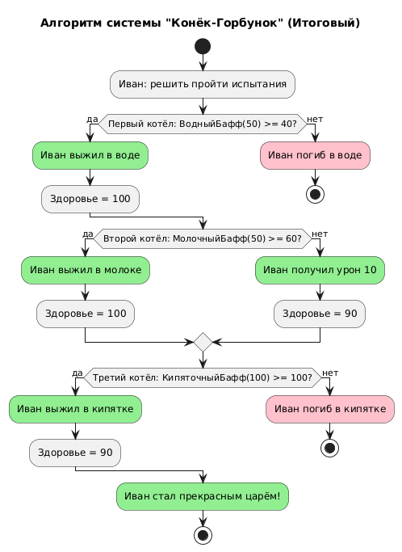
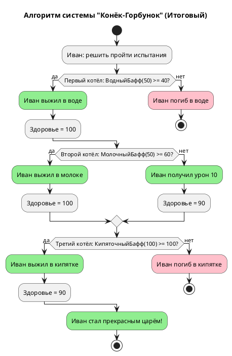

# Activity Diagram: Алгоритм системы "Конёк-Горбунок"

## Обзор

Эта диаграмма активности показывает алгоритм работы системы многоуровневых испытаний из сказки "Конёк-Горбунок".

## Описание потока

### Шаг 1: Начало испытаний
- Иван решает пройти испытания

### Шаг 2: Первый котёл (Вода 40°)
- Иван призывает Конька
- Конёк накладывает ВодныйБафф с защитой = 50
- Check: защита(50) >= температура(40)?
- **Yes** - Иван выживает

### Шаг 3: Второй котёл (Молоко 60°)
- Иван призывает Конька
- Конёк накладывает МолочныйБафф с защитой = 50
- Check: защита(50) >= температура(60)?
- **No** - Иван получает урон 10, но выживает

### Шаг 4: Третий котёл (Кипяток 100°)
- Иван призывает Конька
- Конёк накладывает КипяточныйБафф с защитой = 100
- Check: защита(100) >= температура(100)?
- **Yes** - Иван выживает

### Шаг 5: Превращение
- Иван становится прекрасным царём

## Точки принятия решений

| Условие | Результат |
|-----------|--------|
| ВодныйБафф: защита(50) >= 40 | Yes (50 >= 40) |
| МолочныйБафф: защита(50) >= 60 | No (50 < 60) |
| КипяточныйБафф: защита(100) >= 100 | Yes (100 >= 100) |

## Диаграмма





stop
@enduml
```
