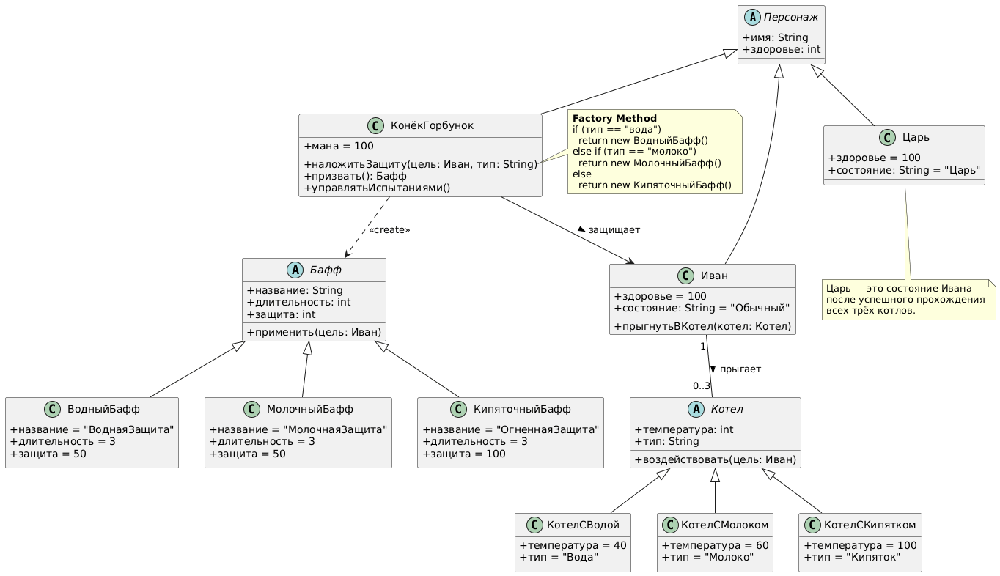
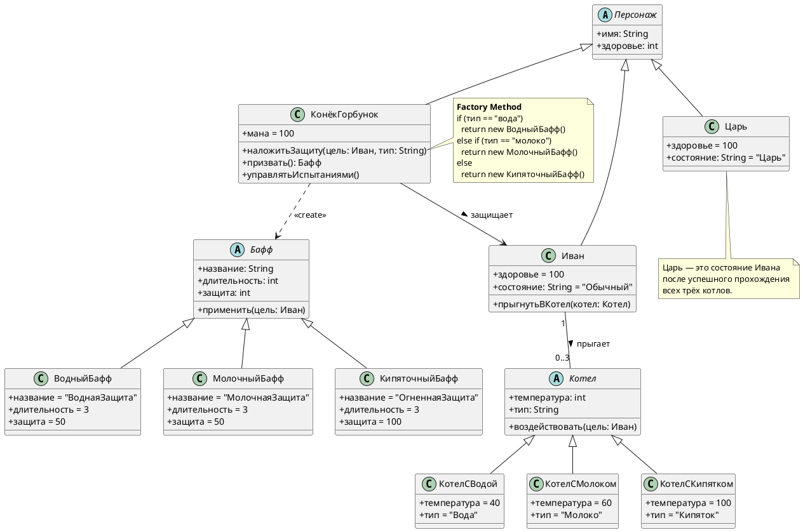

# Class Diagram: Конёк-Горбунок

## Обзор

Эта диаграмма классов показывает объектно-ориентированную структуру системы многоуровневых испытаний из сказки "Конёк-Горбунок".

## Иерархия классов

### Иерархия существ

| Class | Type | Attributes | Methods |
|-------|------|------------|---------|
| Персонаж | Abstract | + имя: String, + здоровье: int | - |
| Иван | Concrete | + здоровье = 100, + состояние: String = "Обычный" | + прыгнутьВКотел(котел: Котел) |
| КонёкГорбунок | Concrete | + мана = 100 | + наложитьЗащиту(цель: Иван, тип: String) |
| Царь | Concrete | + здоровье = 100, + состояние: String = "Царь" | extends Персонаж |

### Иерархия баффов

| Class | Type | Attributes | Methods |
|-------|------|------------|---------|
| Бафф | Abstract | + название: String, + длительность: int, + защита: int | + применить(цель: Иван) |
| ВодныйБафф | Concrete | + название = "ВоднаяЗащита", + длительность = 3, + защита = 50 | extends Бафф |
| МолочныйБафф | Concrete | + название = "МолочнаяЗащита", + длительность = 3, + защита = 50 | extends Бафф |
| КипяточныйБафф | Concrete | + название = "ОгненнаяЗащита", + длительность = 3, + защита = 100 | extends Бафф |

### Иерархия котлов

| Class | Type | Attributes | Methods |
|-------|------|------------|---------|
| Котел | Abstract | + температура: int, + тип: String | + воздействовать(цель: Иван) |
| КотелСВодой | Concrete | + температура = 40, + тип = "Вода" | extends Котел |
| КотелСМолоком | Concrete | + температура = 60, + тип = "Молоко" | extends Котел |
| КотелСКипятком | Concrete | + температура = 100, + тип = "Кипяток" | extends Котел |

### Контроллер

| Класс | Тип | Методы |
|-------|------|---------|
| КонёкГорбунок | Конкретный | + призвать(): Бафф, + управлятьИспытаниями() |

## Связи

- **КонёкГорбунок ..> Бафф**: Creates (<<create>>)
- **КонёкГорбунок --> Иван**: Защищает (<<protect>>)
- **Иван "1" -- "0..3" Котел**: Прыгает (<<jump>>)

## Шаблоны проектирования

### Фабричный метод
```java
public Бафф наложитьЗащиту(тип: String) {
    if (тип == "вода") 
        return new ВодныйБафф()
    else if (тип == "молоко")
        return new МолочныйБафф()
    else 
        return new КипяточныйБафф()
}
```

## Заметки

- **Царь** — это конечное состояние Ивана после прохождения испытаний
- Иван имеет здоровье = 100, ВодныйБафф и МолочныйБафф дают защиту 50, КипяточныйБафф даёт защиту 100
- Котлы имеют разную температуру: Вода (40°), Молоко (60°), Кипяток (100°)
- Иван после трёх котлов становится прекрасным царём

## Диаграмма




