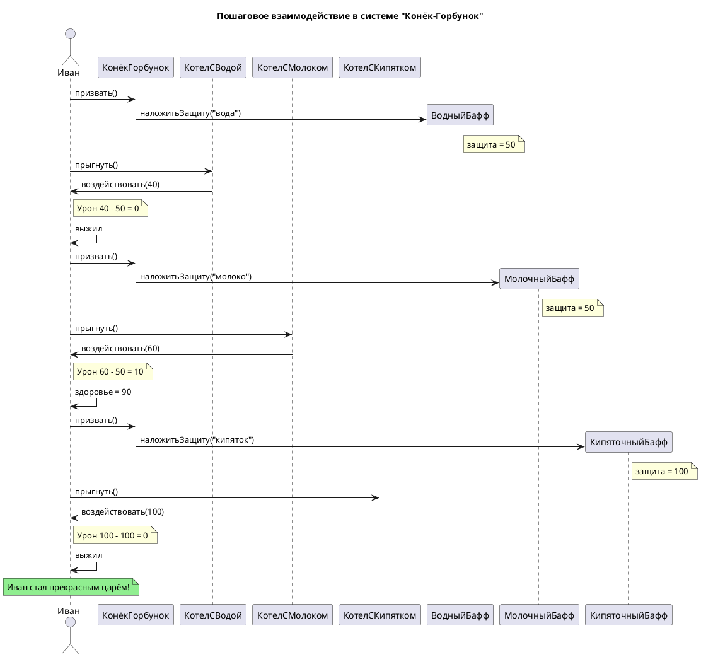

Вот диаграмма Sequence для **«Конёк-Горбунок» (Система многоуровневых испытаний)** , полностью повторяющая форматирование и структуру вашего шаблона:

---

# Sequence Diagram: Взаимодействие в системе "Конёк-Горбунок"

## Обзор

Эта диаграмма последовательности показывает пошаговое взаимодействие между актерами и объектами в системе многоуровневых испытаний из сказки "Конёк-Горбунок".

## Актеры и участники

| Актер/Участник | Описание |
|-------------------|-------------|
| Иван (I) | Главный герой, проходит испытания |
| КонёкГорбунок (H) | Накладывает защиту перед каждым котлом |
| КотелСВодой (WC) | Первый котёл с температурой = 40 |
| КотелСМолоком (MC) | Второй котёл с температурой = 60 |
| КотелСКипятком (BC) | Третий котёл с температурой = 100 |
| ВодныйБафф (WB) | Защита +50 |
| МолочныйБафф (MB) | Защита +50 |
| КипяточныйБафф (BB) | Защита +100 |

## Interaction Steps

### Шаг 1: Подготовка к первому котлу
- Иван calls КонёкГорбунок
- КонёкГорбунок creates ВодныйБафф
- Note: защита = 50

### Шаг 2: Первый котёл (Вода 40°)
- Иван jumps into КотелСВодой
- КотелСВодой deals 40 damage
- Note: Урон 40 - Защита 50 = 0, Иван выжил

### Шаг 3: Подготовка ко второму котлу
- Иван calls КонёкГорбунок
- КонёкГорбунок creates МолочныйБафф
- Note: защита = 50

### Шаг 4: Второй котёл (Молоко 60°)
- Иван jumps into КотелСМолоком
- КотелСМолоком deals 60 damage
- Note: Урон 60 - Защита 50 = 10, Иван выжил с 90 HP

### Шаг 5: Подготовка к третьему котлу
- Иван calls КонёкГорбунок
- КонёкГорбунок creates КипяточныйБафф
- Note: защита = 100

### Шаг 6: Третий котёл (Кипяток 100°)
- Иван jumps into КотелСКипятком
- КотелСКипятком deals 100 damage
- Note: Урон 100 - Защита 100 = 0, Иван выжил

### Шаг 7: Финал
- Note over I: Иван стал прекрасным царём!

## Ключевые наблюдения

1. Конёк-Горбунок создаёт бафф перед каждым прыжком (Фабричный метод)
2. ВодныйБафф и МолочныйБафф дают защиту 50, КипяточныйБафф даёт защиту 100
3. Котлы имеют разную температуру: Вода (40°), Молоко (60°), Кипяток (100°)
4. Иван выживает во всех трёх котлах и становится прекрасным царём

## Диаграмма

