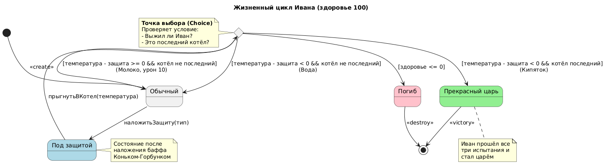
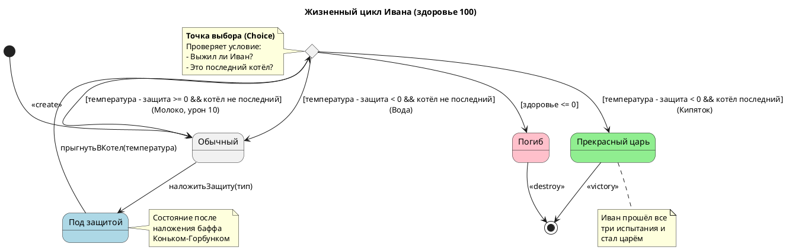

# State Diagram: Жизненный цикл Ивана

## Обзор

Эта диаграмма состояний показывает жизненный цикл Ивана с здоровье = 100 при прохождении трёх котлов.

## Состояния

| Состояние | Описание | Цвет фона |
|-------|-------------|------------------|
| Обычный | Иван в обычном состоянии | Default |
| ПодЗащитой | Иван под действием баффа | Lightblue |
| ПрекрасныйЦарь | Иван после прохождения всех котлов | Lightgreen |
| Погиб | Иван погиб в котле | Pink |

## Переходы состояний

### Начальное состояние
- [*] --> Обычный : <<create>>

### Переход: наложитьЗащиту(тип)
- Из Обычного в ПодЗащитой

### Переход: прыгнутьВКотел(температура)
- Из ПодЗащитой в точку выбора (c)

### Логика точки выбора
| Условие | Следующее состояние |
|-----------|------------|
| температура - защита < 0 && котёл не последний | Обычный (Вода) |
| температура - защита >= 0 && котёл не последний | Обычный (Молоко, урон 10) |
| температура - защита < 0 && котёл последний | ПрекрасныйЦарь (Кипяток) |
| здоровье <= 0 | Погиб |

### Конечное состояние
- ПрекрасныйЦарь --> [*] : <<victory>>
- Погиб --> [*] : <<destroy>>

## Ключевые моменты

- **Точка выбора (c)**: Проверяет условие выживания
  - Если урон < здоровья и котёл не последний, возвращает в "Обычный"
  - Если урон < здоровья и котёл последний, переходит в "ПрекрасныйЦарь"
  - Если здоровье <= 0, переходит в "Погиб"

- ВодныйБафф имеет защиту = 50, температура воды = 40 (урон 0)
- МолочныйБафф имеет защиту = 50, температура молока = 60 (урон 10)
- КипяточныйБафф имеет защиту = 100, температура кипятка = 100 (урон 0)
- Иван после трёх котлов становится прекрасным царём

## Диаграмма

