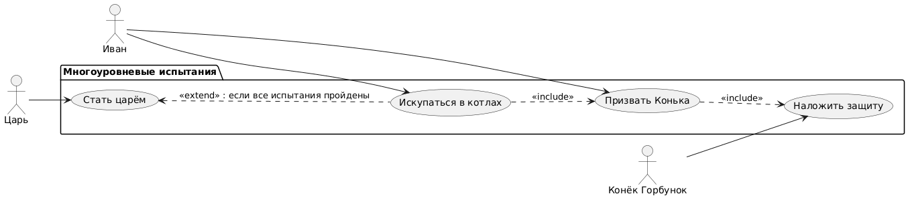

Вот диаграмма Use Case для **«Конёк-Горбунок» (Система многоуровневых испытаний)** , полностью повторяющая форматирование и структуру вашего шаблона:

---

# Use Case Diagram: Многоуровневые испытания

## Актеры

| Актер | Описание |
|-------|-------------|
| Иван | Главный герой, проходит испытания |
| Конёк Горбунок | Помощник, накладывает защиту |
| Царь | Наблюдает за результатом |

## Варианты использования

### Пакет: Многоуровневые испытания

| Вариант использования | Описание |
|----------|-------------|
| Искупаться в котлах | Прыгнуть в три котла (вода, молоко, кипяток) |
| Призвать Конька | Позвать Конька-Горбунка для помощи |
| Наложить защиту | Наложить защитный бафф перед прыжком |
| Стать царём | Превратиться в прекрасного царя |

## Связи

### Актер к варианту использования

- **Иван** выполняет: Искупаться в котлах
- **Иван** выполняет: Призвать Конька
- **Конёк Горбунок** выполняет: Наложить защиту
- **Царь** выполняет: Стать царём (наблюдает)

### Отношения Extend/Include

- **Искупаться в котлах** →→ **Призвать Конька** (<<include>>)
- **Призвать Конька** →→ **Наложить защиту** (<<include>>)
- **Стать царём** ←← **Искупаться в котлах** (<<extend>>): если все испытания пройдены

## Диаграмма



```
@startuml
left to right direction

actor "Иван" as Ivan
actor "Конёк Горбунок" as Horse
actor "Царь" as King

package "Многоуровневые испытания" {
  usecase "Искупаться в котлах" as Bath
  usecase "Призвать Конька" as Call
  usecase "Наложить защиту" as Protect
  usecase "Стать царём" as BecomeKing
}

' Иван купается в котлах (действие)
Ivan --> Bath

' Иван призывает Конька (действие)
Ivan --> Call

' Конёк накладывает защиту (действие)
Horse --> Protect

' Царь наблюдает за результатом (действие)
King --> BecomeKing

' Зависимости внутри системы
Bath ..> Call : <<include>>
Call ..> Protect : <<include>>
BecomeKing <.. Bath : <<extend>> : если все испытания пройдены
@enduml
```

## Описание

Эта диаграмма вариантов использования иллюстрирует сценарий сказки, связанный с историей "Конёк-Горбунок":

1. **Иван** должен **искупаться в котлах** (вода, молоко, кипяток)
2. **Иван** перед каждым испытанием **призывает Конька**
3. **Конёк-Горбунок** **накладывает защиту** на Ивана
4. **Царь** наблюдает за результатом
5. Если все испытания пройдены, **Иван становится царём**

Связь показывает, что купание в котлах включает призыв Конька (include), призыв включает наложение защиты (include), а превращение в царя является расширением успешного купания (extend).
